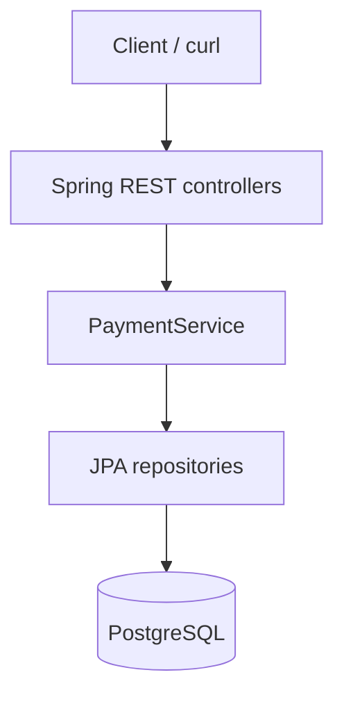
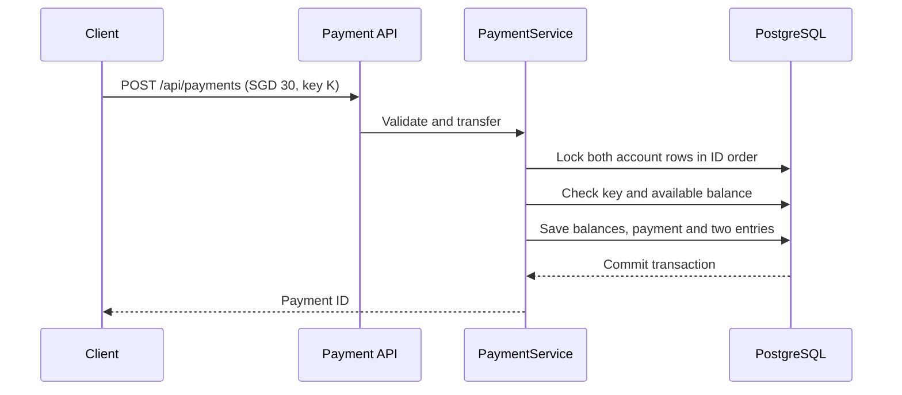

# PayFlow

PayFlow is a Java and Spring Boot learning project that **simulates transfers between SGD accounts**. I built it to understand how a payment request moves through an API, service layer, database transaction and ledger. It uses demo balances and no real money.

## What can it do?

Create two accounts, give one a demo opening balance, and send an amount from one to the other. PayFlow checks the request, prevents an overdraft, updates both balances, and records two signed ledger entries. You can then inspect the account balances, payment history and entries for a payment.

| Implemented | Still to build |
|---|---|
| Account creation and balance lookup | Authenticated users and account ownership |
| SGD account transfers | Real funding and external payment rails |
| Paired transfer ledger entries | Funding ledger and reconciliation |
| Idempotency keys and row locks | Database migrations, outbox and event delivery |
| Payment history and ledger lookup | Deployment and operational monitoring |

## How the pieces fit



- **Controllers** accept JSON and validate required fields, amounts and the idempotency key.
- **PaymentService** owns the transfer rules and wraps the database work in one transaction.
- **Repositories** use Spring Data JPA to read and write accounts, payments and ledger entries.
- **PostgreSQL** stores the results. H2 is used by the included tests.

Start at [PaymentController](src/main/java/com/madhu/payflow/payment/PaymentController.java), follow the call into [PaymentService](src/main/java/com/madhu/payflow/payment/PaymentService.java), then inspect the [account](src/main/java/com/madhu/payflow/account/) and [payment](src/main/java/com/madhu/payflow/payment/) entities and repositories.

## Walk through a transfer

Suppose Alice starts with **SGD 100.00** and Bob with **SGD 0.00**. Alice sends Bob **SGD 30.00**.



If validation or a database write fails, the transaction rolls back. Accounts are locked in ID order so simultaneous transfers cannot spend the same available balance through this service.

### Why two ledger entries?

| Account | Before | Entry | After |
|---|---:|---:|---:|
| Alice | SGD 100.00 | SGD -30.00 | SGD 70.00 |
| Bob | SGD 0.00 | SGD +30.00 | SGD 30.00 |
| **Net movement** | | **SGD 0.00** | |

Each successful transfer writes a negative entry for the sender and a positive entry for the recipient. The entries sum to zero. The account table also stores the current balances for quick lookup; this project does not yet recalculate those balances from the ledger.

**Important boundary:** the opening balances are demo seed values. They have no corresponding funding entries, so the ledger covers transfers, not the entire lifecycle of money in the system.

### What if the client retries?

The client sends an `Idempotency-Key` with each transfer. Repeating the **same request with the same key** returns the original payment without moving funds again. Reusing that key for different account IDs or an amount that differs returns a conflict. A unique database constraint backs the key, while account locks serialize competing transfers involving the same accounts.

## API at a glance

| Method | Route | Purpose |
|---|---|---|
| `POST` | `/api/accounts` | Create an SGD account with a demo opening balance |
| `GET` | `/api/accounts/{id}` | Read account details and balance |
| `POST` | `/api/payments` | Transfer funds; requires `Idempotency-Key` |
| `GET` | `/api/accounts/{id}/payments` | List payments involving an account |
| `GET` | `/api/payments/{id}/ledger` | Read the two signed entries for a payment |

This is a learning API with **no authentication or authorization**. Run it only in a local development environment.

## Run it locally

You need Java 17+, Maven 3.6.3+ and Docker Compose.

```bash
docker compose up -d db
mvn spring-boot:run
```

The app connects to the local PostgreSQL service in [compose.yaml](compose.yaml). Its credentials are for local development. For another environment, set `DB_URL`, `DB_USER` and `DB_PASSWORD`. Hibernate currently uses `ddl-auto: update`; a migration tool is planned before deployment.

In a second terminal, create two accounts and transfer SGD 30:

```bash
curl -s -X POST http://localhost:8080/api/accounts \
  -H 'Content-Type: application/json' \
  -d '{"name":"Alice","currency":"SGD","openingBalance":100.00}'

curl -s -X POST http://localhost:8080/api/accounts \
  -H 'Content-Type: application/json' \
  -d '{"name":"Bob","currency":"SGD","openingBalance":0.00}'

curl -s -X POST http://localhost:8080/api/payments \
  -H 'Content-Type: application/json' \
  -H 'Idempotency-Key: alice-to-bob-001' \
  -d '{"fromAccountId":1,"toAccountId":2,"amount":30.00}'

curl -s http://localhost:8080/api/accounts/1
curl -s http://localhost:8080/api/accounts/2
curl -s http://localhost:8080/api/accounts/1/payments
curl -s http://localhost:8080/api/payments/1/ledger
```

On a fresh database, Alice ends at **70.00**, Bob at **30.00**, and the ledger entries are **-30.00** and **+30.00**. Account and payment IDs can differ if data already exists. Repeat the payment request with the same key to observe the retry behavior.

Run the included tests with `mvn test`. They exercise a successful transfer, a duplicate request, balanced entries and an overdraft rejection using H2. The tests have **not yet been run in the environment where this repository was created**.

## What I am learning from this project

1. **REST and validation:** map HTTP requests to Java records, then reject malformed payment requests.
2. **Persistence:** use JPA entities and repositories to store accounts, payments and ledger entries.
3. **Atomicity:** place all changes for one transfer in a single `@Transactional` operation.
4. **Concurrency:** lock account rows in a consistent order before checking and updating balances.
5. **Idempotency:** make retries safe when a client is unsure whether a request succeeded.
6. **Ledger reasoning:** record equal and opposite movements for each transfer.

## Next steps

1. Model funding with balanced entries and add a reconciliation check between balances and the ledger.
2. Replace automatic schema updates with Flyway migrations and add API and PostgreSQL integration tests.
3. Add authentication, ownership checks and authorization before exposing the API beyond local development.
4. Add a transactional outbox for payment events; then explore Kafka consumers and a fraud risk service.

### References used for learning

- [Spring: Accessing Data with JPA](https://spring.io/guides/gs/accessing-data-jpa/)
- [Spring: Managing Transactions](https://spring.io/guides/gs/managing-transactions/)

The diagrams describe the current implementation; Kafka, fraud checks and external payment providers are planned rather than claimed features.
